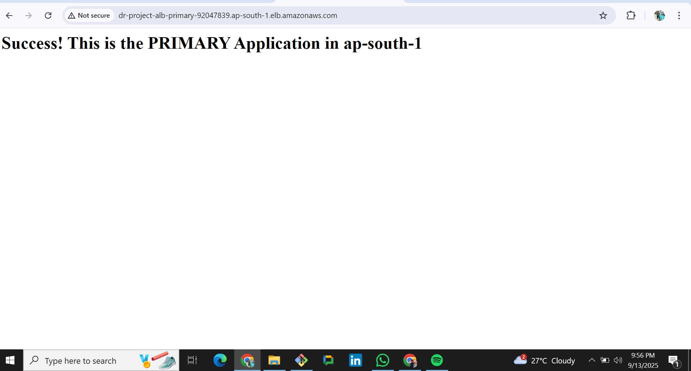
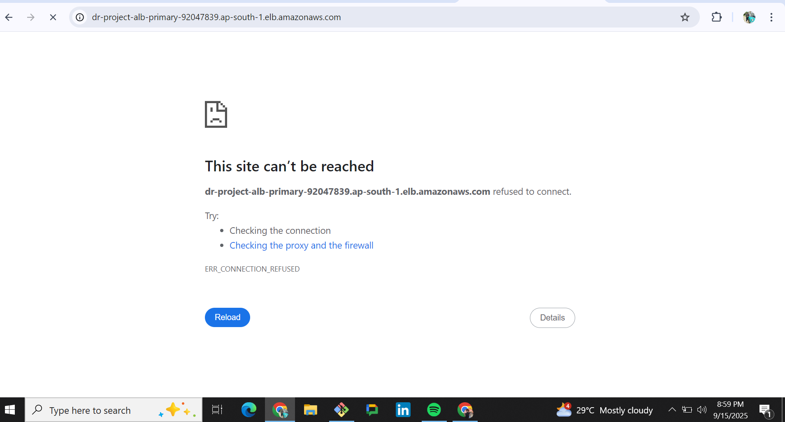
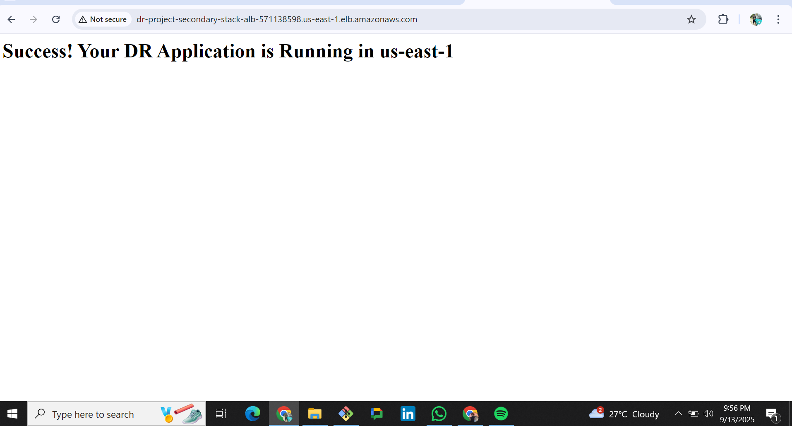

# AWS-Disaster-Recovery-Setup-for-a-Multi-Tier-Web-App
# Automated AWS Disaster Recovery for a 3-Tier Web Application

### Project Summary
This project demonstrates a resilient, automated disaster recovery (DR) solution for a 3-tier web application built on AWS. The primary goal was to ensure business continuity by deploying a fully functional secondary site in a separate AWS region using Infrastructure as Code. The project concluded with a successful live failover test, proving the DR strategy was effective.

---
### Key Features
* **Automation:** The entire DR environment is deployed automatically using a **CloudFormation** template (`template.yaml`).
* **High Availability:** The architecture in each region uses an **Application Load Balancer** and an **Auto Scaling Group** to ensure the application is self-healing.
* **Multi-Region DR:** A "Warm Standby" strategy was implemented with a primary site in `ap-south-1` and a DR site in `us-east-1`.
* **Managed Database:** **Amazon RDS** was used to provide a reliable and secure database service.

---
### Architecture Diagram
This diagram shows the complete multi-region architecture.

---
### Core Technologies Used
* **AWS CloudFormation (Infrastructure as Code)**
* **Amazon EC2 & Auto Scaling**
* **Application Load Balancer (ALB)**
* **Amazon RDS**
* **AWS CLI**
* **AWS Secrets Manager**

---
---
### Live Failover Test Demonstration

[cite_start]The following screenshots document the successful live failover test conducted on September 14, 2025[cite: 34]. [cite_start]The test simulated a critical failure of the primary application to validate the readiness of the disaster recovery environment[cite: 42, 43].

**1. Before the Test: Primary Site is Healthy**

The primary application in `ap-south-1` was confirmed to be online and serving traffic correctly before the test began.

**2. After Simulating Failure: Primary Site is Unreachable**

[cite_start]After deleting the listener on the primary Application Load Balancer, the site immediately became unreachable, confirming a successful failure simulation[cite: 43].

**3. After Simulating Failure: DR Site Remains Healthy**

The disaster recovery application in `us-east-1` was completely unaffected by the primary site's failure and remained online to serve traffic. [cite_start]This proved the success of the DR strategy[cite: 44, 63].

---
### Project Deliverables
* [Disaster Recovery Runbook.pdf](Disaster%20Recovery%20Runbook.pdf): A step-by-step guide for the failover procedure.
* [RPO&RTO Analysis.pdf](RPO&RTO%20Analysis.pdf): A full report on the project's test results, challenges, and success criteria.
